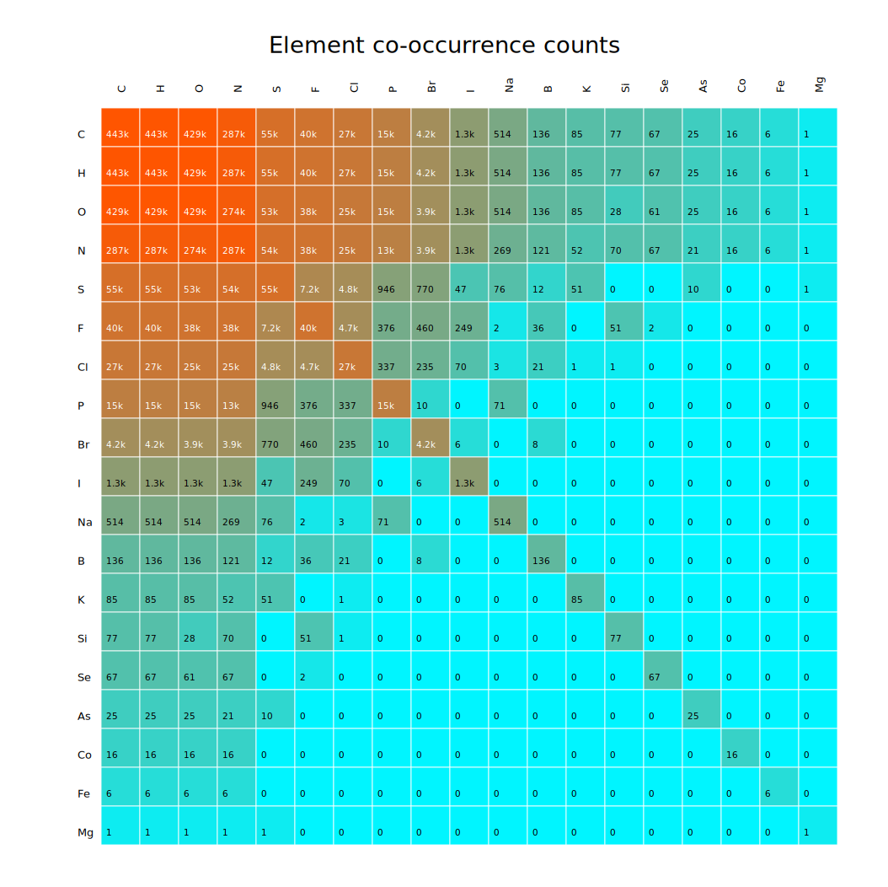
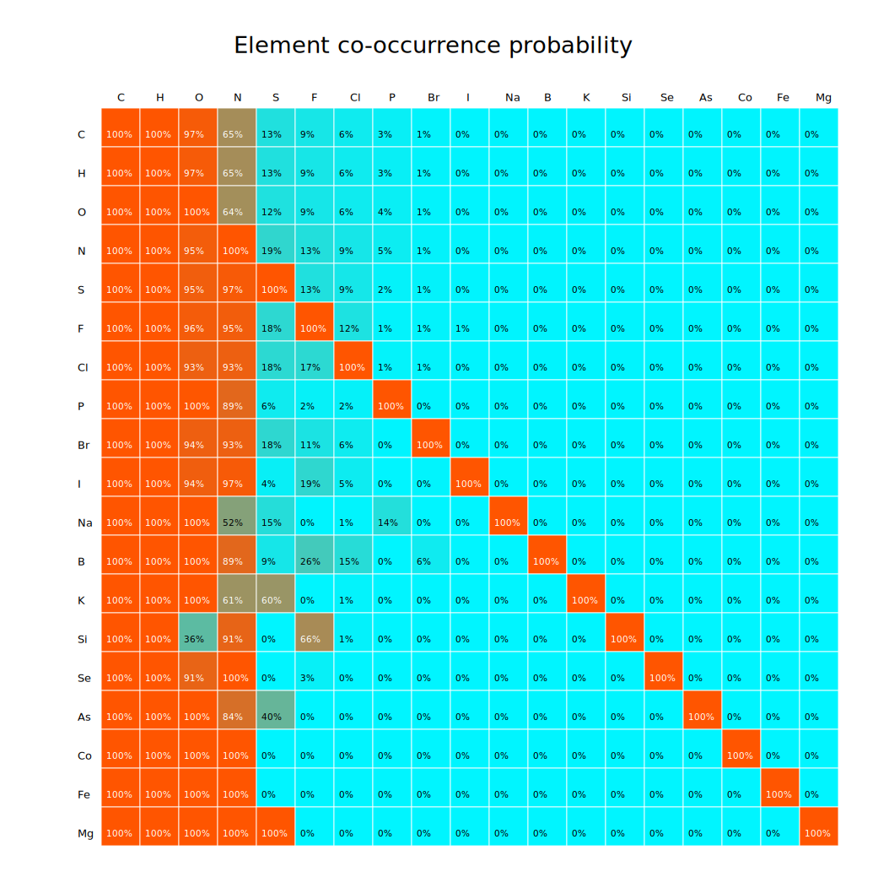

# Element co-occurrence profile

This report summarizes which chemical elements appear together in molecular formulas across the dataset.

## Summary

| Metric | Value |
|---|---:|
| Total spectra | 443905 |
| Spectra with formula | 443905 |
| Observed elements | 19 |

Heatmap elements shown: `C`, `H`, `O`, `N`, `S`, `F`, `Cl`, `P`, `Br`, `I`, `Na`, `B`, `K`, `Si`, `Se`, `As`, `Co`, `Fe`, `Mg`.

## How to read this report

- **Raw co-occurrence count** counts how many formulas contain both the row element and the column element.
- **Conditional probability** reads row-wise: `P(column element | row element)`.
- The diagonal shows how often each element appears with itself, which is equivalent to that element's presence count.
- Raw-count colors are log-scaled so that common elements like carbon, hydrogen, oxygen, and nitrogen do not flatten the rest of the plot.

## Tables

- [Element counts](tables/element_counts.csv)
- [Raw co-occurrence counts](tables/element_cooccurrence_counts.csv)
- [Conditional probabilities](tables/element_cooccurrence_conditional_probability.csv)

## Heatmaps

### Raw co-occurrence counts

### Conditional probability

