# `P` profile for `annotated_ms2`

This report summarizes how often the target element `P` appears across metadata groups in `annotated_ms2`.

## How to interpret this report

This report treats each spectrum as **positive** when its molecular formula contains the target element `P`. A spectrum is **negative** when its formula does not contain `P`.

A **metadata group** means one metadata field and one value inside that field. For example, in the `NPC classes` table, `Carboline alkaloids` is one group. In the `Ion mode` table, `Positive` is one group.

The profiler compares the target-positive spectra against these groups to show where the target element is common, rare, concentrated, or poorly supported.

Important caveats:
- These reports are based on formula metadata, not direct spectral proof of the element.
- Some metadata fields can contain multiple pipe-separated values, so assignment counts can be larger than the number of spectra.
- Highly enriched small groups can be interesting, but they should not be overinterpreted without checking support counts.

## Glossary and external references

| Term | Meaning in this report | Reference |
|---|---|---|
| Molecular formula | Formula metadata used to decide whether a spectrum is target-positive. | [PubChem glossary - Molecular Formula](https://pubchem.ncbi.nlm.nih.gov/docs/glossary#section=Molecular-Formula) |
| Target-positive spectrum | A spectrum whose molecular formula contains the selected target element. | Local report definition |
| Metadata group | A group formed from one metadata field and one value, such as `NPC classes = Carboline alkaloids`. | Local report definition |
| NPC pathways / superclasses / classes | Natural-product classification fields from NPClassifier-style annotations. | [NPClassifier](https://npclassifier.ucsd.edu/) |
| ClassyFire taxonomy | Chemical taxonomy fields such as kingdom, superclass, class, subclass, and direct parent. | [ClassyFire paper](https://pmc.ncbi.nlm.nih.gov/articles/PMC5096306/) |
| Source dataset | The dataset or library source from which the spectrum metadata originated. | [GNPS libraries](https://ccms-ucsd.github.io/GNPSDocumentation/gnpslibraries/) / [MassSpecGym](https://github.com/pluskal-lab/MassSpecGym) |
| Enrichment | A group has high enrichment when a large percentage of spectra in that group are target-positive. | Local report definition |
| Low support | A warning that a group has too few total spectra, too few target-positive spectra, or no target-positive spectra. | Local report definition |

## Numeric summary

| Metric | Value |
|---|---:|
| Total spectra | 443905 |
| Positive count | 15524 |
| Negative count | 428381 |
| Positive percentage | 3.4971% |

## Atom-count distribution

This section shows how many formula-bearing spectra have exactly `k` atoms of `P`.
The `0` row represents formulas that do not contain `P`.

[CSV table](tables/target_atom_count_distribution.csv)

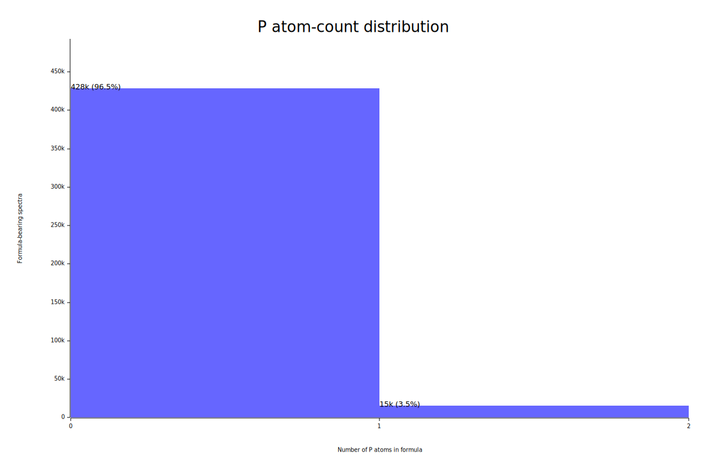

## Top enriched groups

This table compares **metadata groups** across all population-map tables. A metadata group is one field/value pair, such as `NPC classes = Carboline alkaloids` or `Ion mode = Positive`.

The table is sorted by **Positive %**, meaning the percentage of spectra inside that group whose formulas contain the target element. Only groups with at least `30` total spectra are included.

This table answers: **where is the target element unusually common?** It does not necessarily show the groups with the largest absolute number of positives.

| Metadata group | Value | Total | Positive | Positive % | % of positives |
|---|---|---:|---:|---:|---:|
| NPC classes | Glycerophosphoethanolamines | 1575 | 1575 | 100.00% | 10.15% |
| NPC classes | Phosphosphingolipids | 1081 | 1081 | 100.00% | 6.96% |
| NPC classes | Glycerophosphoserines | 412 | 412 | 100.00% | 2.65% |
| NPC classes | Fatty acyl CoAs | 57 | 57 | 100.00% | 0.37% |
| NPC classes | Glycerophosphates | 43 | 43 | 100.00% | 0.28% |
| NPC classes | Glycerophosphocholines | 7671 | 7662 | 99.88% | 49.36% |
| NPC superclasses | Glycerophospholipids | 9759 | 9745 | 99.86% | 62.77% |
| NPC classes | Halogenated hydrocarbons | 124 | 118 | 95.16% | 0.76% |

## Low-support warning summary

This section summarizes warning flags from the population-map CSV tables. The `Count` column is the number of metadata-group rows with that warning, not the number of spectra.

Warning meanings:

| Warning | Meaning |
|---|---|
| `LOW_TOTAL_SUPPORT` | The group has fewer than the minimum number of total spectra. |
| `LOW_TARGET_SUPPORT` | The group has some target-positive spectra, but too few for confident interpretation. |
| `NO_TARGET_POSITIVES` | The group has no spectra whose formulas contain the target element. |

| Warning | Count |
|---|---:|
| `LOW_TARGET_SUPPORT` | 54 |
| `LOW_TOTAL_SUPPORT` | 204 |
| `NO_TARGET_POSITIVES` | 496 |

## Summary

- [Summary table](tables/summary.csv)
- Tables are in [`tables/`](tables/)
- Figures are in [`figures/`](figures/)

## How to read the figures

- **Target count** shows which groups contribute the most target-positive spectra.
- **Percent target** shows which groups are most enriched for the target element.
- Small groups can look highly enriched, so check the linked CSV tables for support counts.

## NPC pathways

Groups spectra by broad natural-product pathway annotations.

[CSV table](tables/contains_by_npc_pathways.csv)

<table>
<tr>
<th>Top groups by target count</th>
<th>Top groups by percent target</th>
</tr>
<tr>
<td width="50%">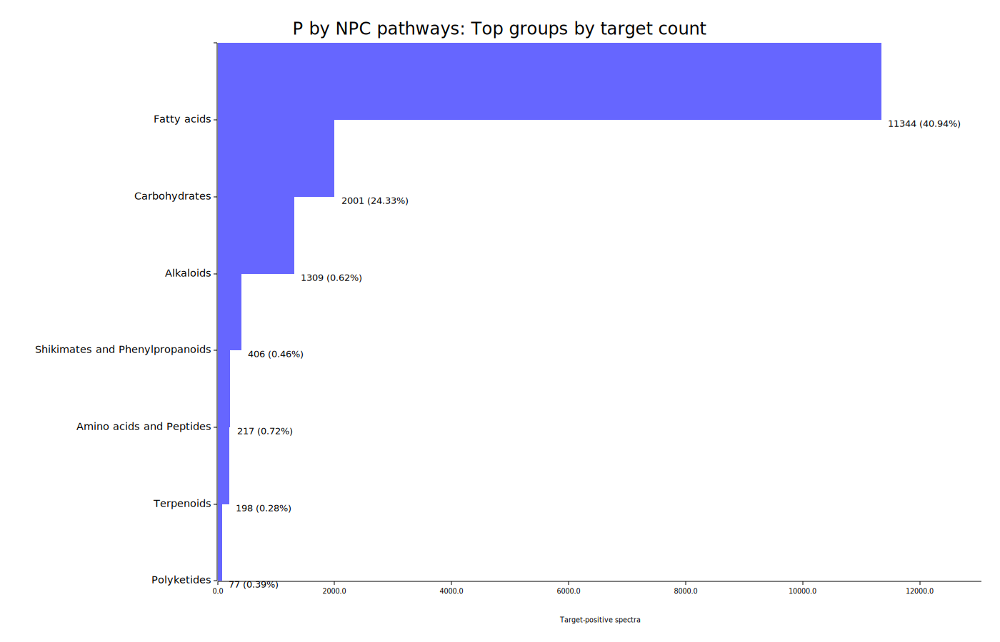</td>
<td width="50%">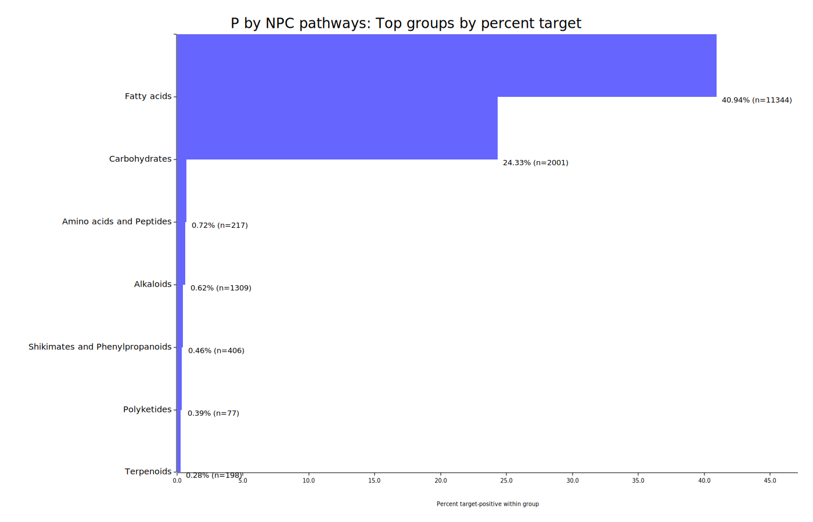</td>
</tr>
</table>

## NPC superclasses

Groups spectra by intermediate natural-product superclass annotations.

[CSV table](tables/contains_by_npc_superclasses.csv)

<table>
<tr>
<th>Top groups by target count</th>
<th>Top groups by percent target</th>
</tr>
<tr>
<td width="50%">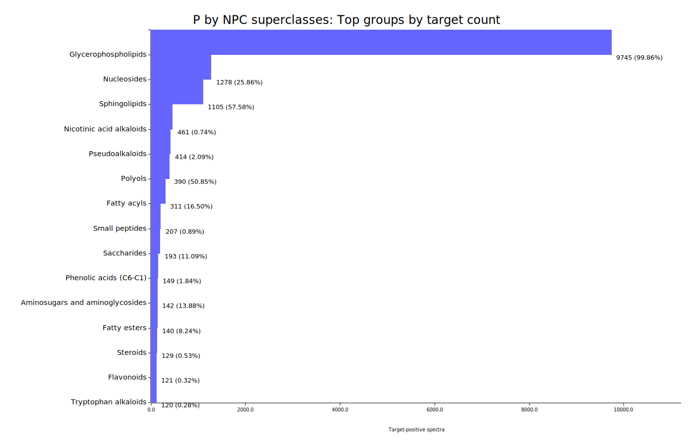</td>
<td width="50%">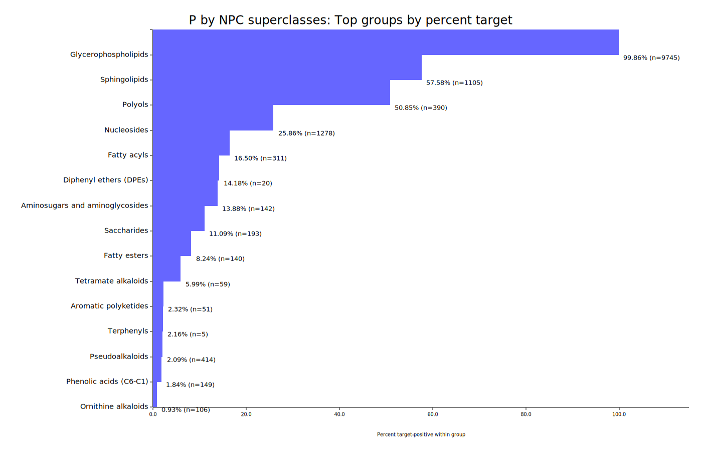</td>
</tr>
</table>

## NPC classes

Groups spectra by more specific natural-product class annotations.

[CSV table](tables/contains_by_npc_classes.csv)

<table>
<tr>
<th>Top groups by target count</th>
<th>Top groups by percent target</th>
</tr>
<tr>
<td width="50%">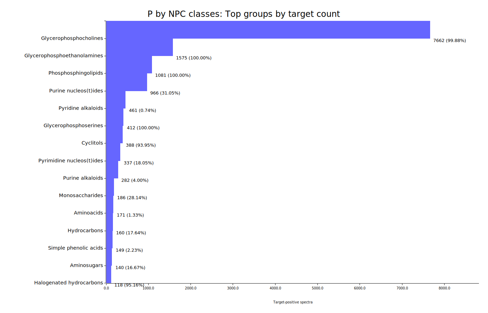</td>
<td width="50%">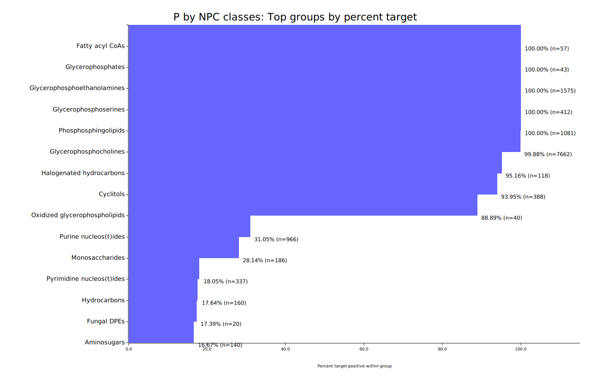</td>
</tr>
</table>

## Source dataset

Groups spectra by the dataset or spectral-library source recorded in metadata.

[CSV table](tables/contains_by_source_dataset.csv)

<table>
<tr>
<th>Top groups by target count</th>
<th>Top groups by percent target</th>
</tr>
<tr>
<td width="50%">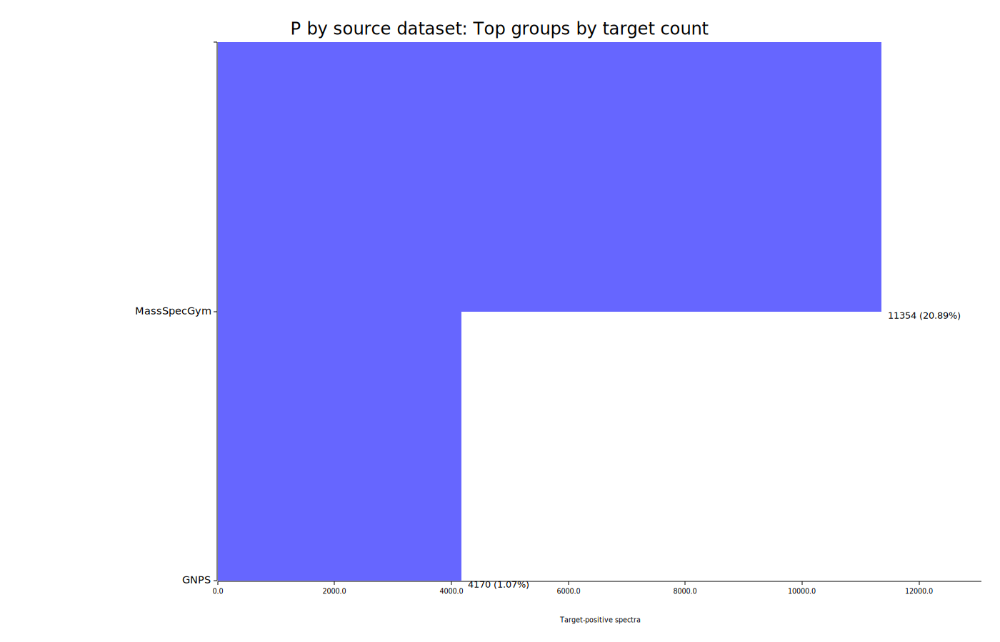</td>
<td width="50%">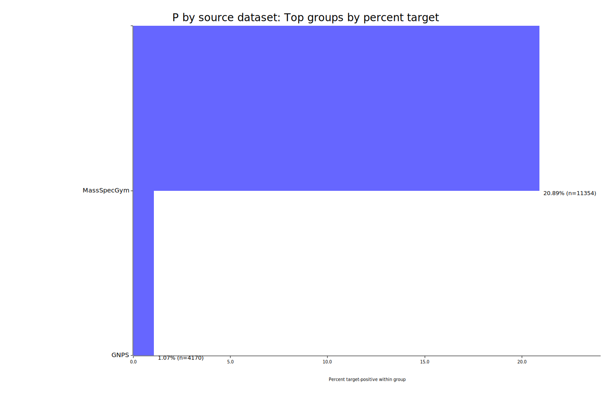</td>
</tr>
</table>

## Organism

Groups spectra by organism or source-organism metadata when available.

[CSV table](tables/contains_by_organism.csv)

<table>
<tr>
<th>Top groups by target count</th>
<th>Top groups by percent target</th>
</tr>
<tr>
<td width="50%">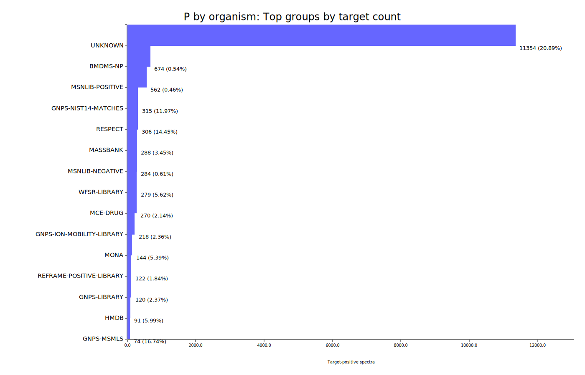</td>
<td width="50%">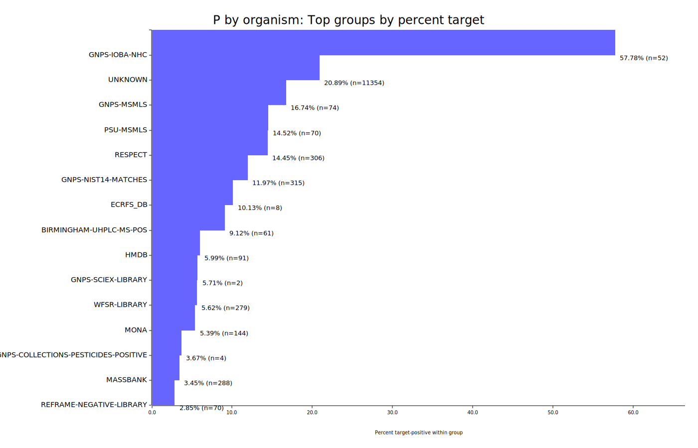</td>
</tr>
</table>

## Ion mode

Groups spectra by recorded ionization mode, such as positive or negative mode.

[CSV table](tables/contains_by_ion_mode.csv)

<table>
<tr>
<th>Top groups by target count</th>
<th>Top groups by percent target</th>
</tr>
<tr>
<td width="50%">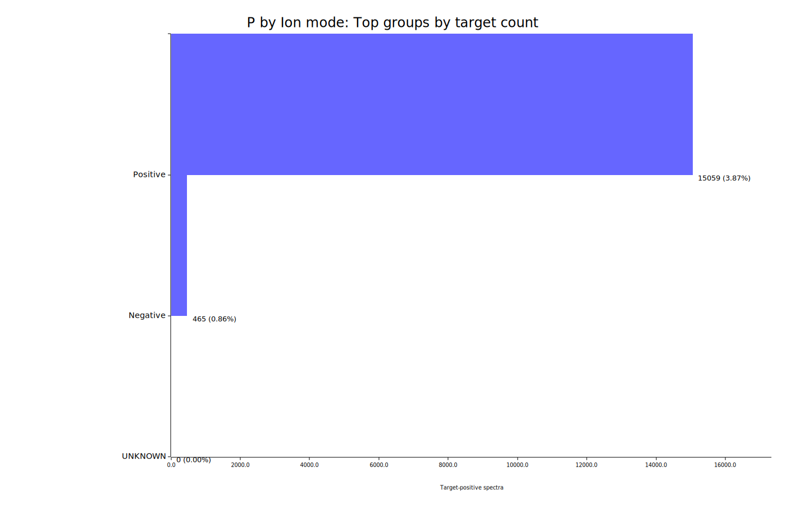</td>
<td width="50%">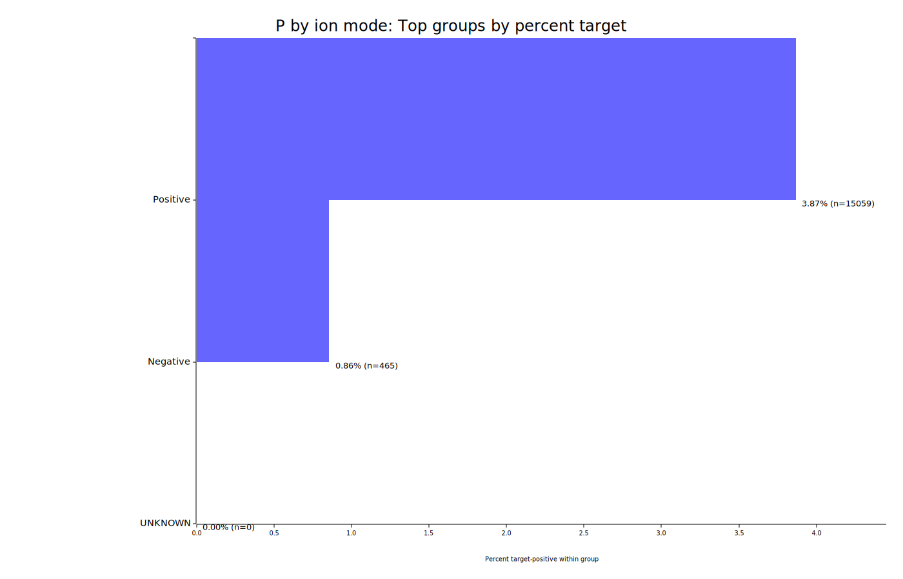</td>
</tr>
</table>

## Source instrument

Groups spectra by the instrument metadata associated with the source record.

[CSV table](tables/contains_by_source_instrument.csv)

<table>
<tr>
<th>Top groups by target count</th>
<th>Top groups by percent target</th>
</tr>
<tr>
<td width="50%">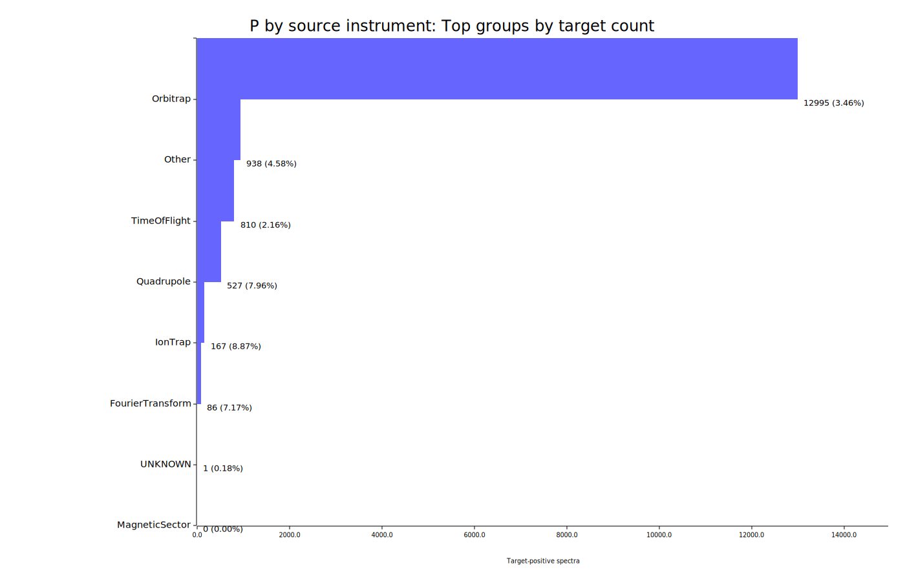</td>
<td width="50%">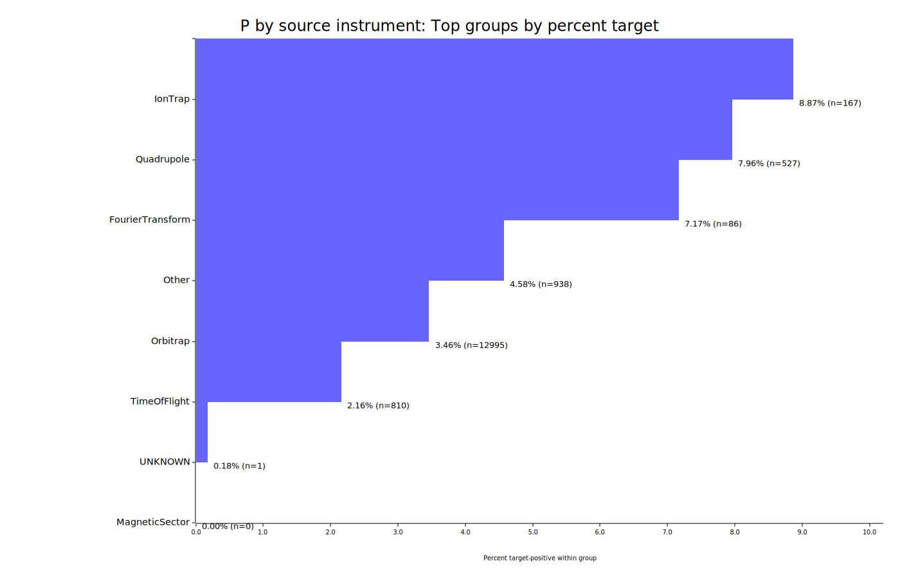</td>
</tr>
</table>

## Library quality

Groups spectra by the recorded quality label from the source library metadata.

[CSV table](tables/contains_by_library_quality.csv)

<table>
<tr>
<th>Top groups by target count</th>
<th>Top groups by percent target</th>
</tr>
<tr>
<td width="50%">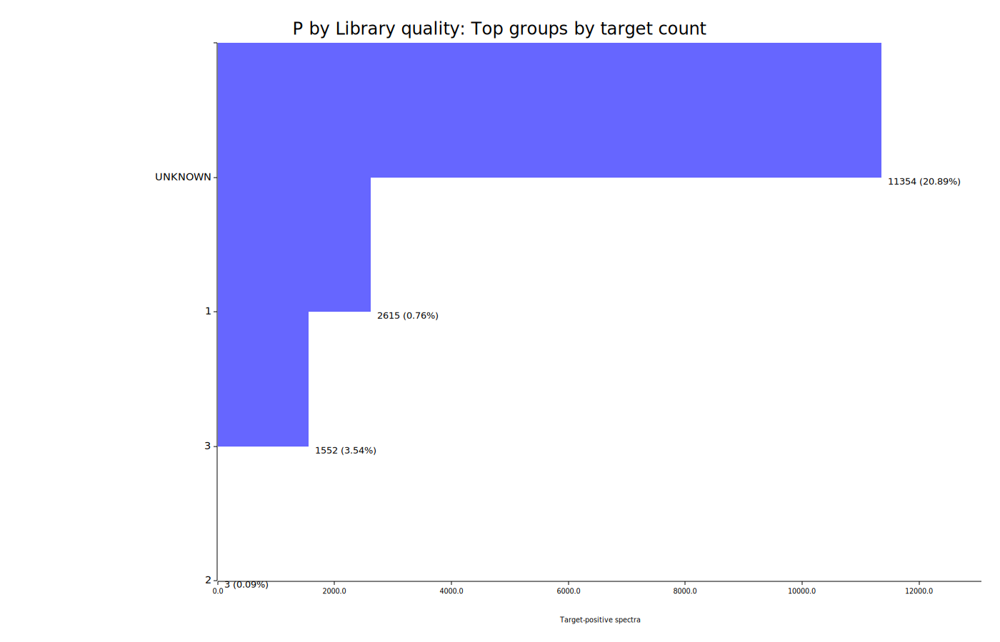</td>
<td width="50%">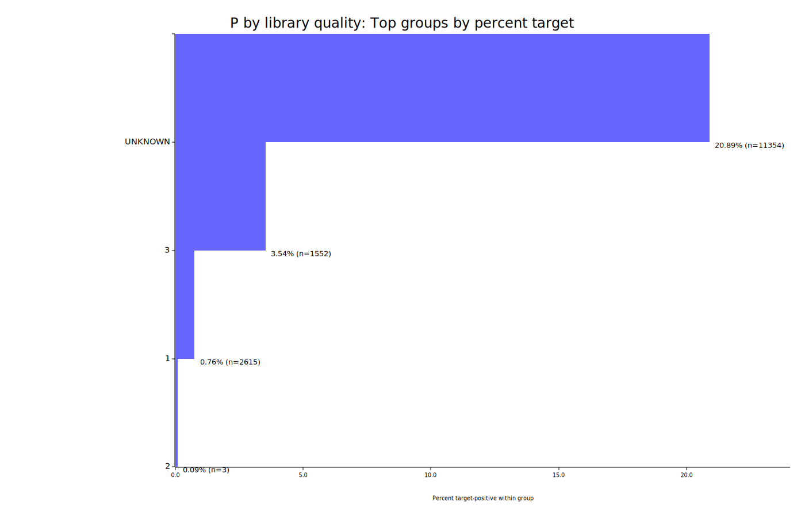</td>
</tr>
</table>
