# `Se` profile for `annotated_ms2`

This report summarizes how often the target element `Se` appears across metadata groups in `annotated_ms2`.

## Numeric summary

| Metric | Value |
|---|---:|
| Total spectra | 443905 |
| Positive count | 67 |
| Negative count | 443838 |
| Positive percentage | 0.0151% |

## Top enriched groups

These are the most target-enriched metadata groups with at least `30` total spectra.

| Metadata group | Value | Total | Positive | Positive % | % of positives |
|---|---|---:|---:|---:|---:|
| Organism | CMMC-FOOD-BIOMARKERS | 629 | 9 | 1.43% | 13.43% |
| Organism | GNPS-MSMLS | 442 | 2 | 0.45% | 2.99% |
| Organism | PSU-MSMLS | 482 | 2 | 0.41% | 2.99% |
| NPC classes | Aminoacids | 12822 | 47 | 0.37% | 70.15% |
| Organism | MONA | 2672 | 9 | 0.34% | 13.43% |
| NPC superclasses | Small peptides | 23205 | 47 | 0.20% | 70.15% |
| Organism | HMDB | 1520 | 3 | 0.20% | 4.48% |
| NPC classes | Quinazoline alkaloids | 6532 | 12 | 0.18% | 17.91% |

## Low-support warning summary

| Warning | Count |
|---|---:|
| `LOW_TARGET_SUPPORT` | 20 |
| `LOW_TOTAL_SUPPORT` | 204 |
| `NO_TARGET_POSITIVES` | 642 |
## Summary

- [Summary table](tables/summary.csv)
- Tables are in [`tables/`](tables/)
- Figures are in [`figures/`](figures/)

## How to read the figures

- **Target count** shows which groups contribute the most target-positive spectra.
- **Percent target** shows which groups are most enriched for the target element.
- Small groups can look highly enriched, so check the linked CSV tables for support counts.

## NPC pathways

Natural-product pathway-level distribution for the target element.

[CSV table](tables/contains_by_npc_pathways.csv)

<table>
<tr>
<th>Top groups by target count</th>
<th>Top groups by percent target</th>
</tr>
<tr>
<td width="50%">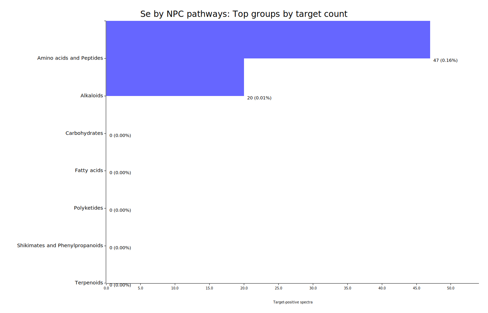</td>
<td width="50%">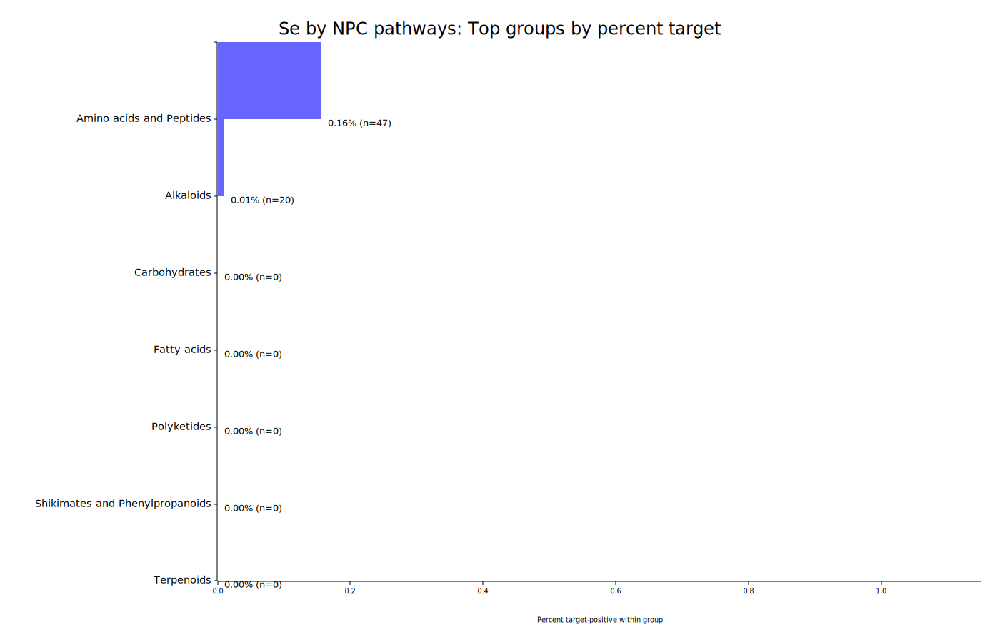</td>
</tr>
</table>

## NPC superclasses

Natural-product superclass-level distribution for the target element.

[CSV table](tables/contains_by_npc_superclasses.csv)

<table>
<tr>
<th>Top groups by target count</th>
<th>Top groups by percent target</th>
</tr>
<tr>
<td width="50%">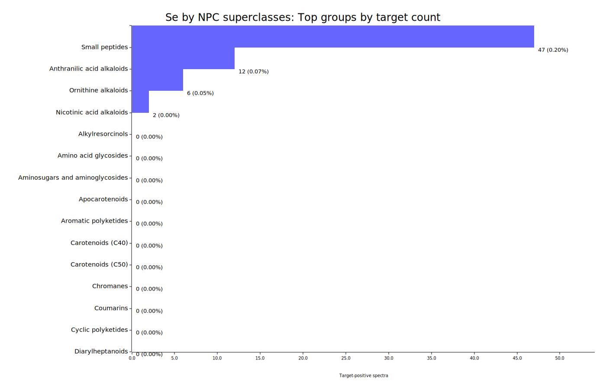</td>
<td width="50%">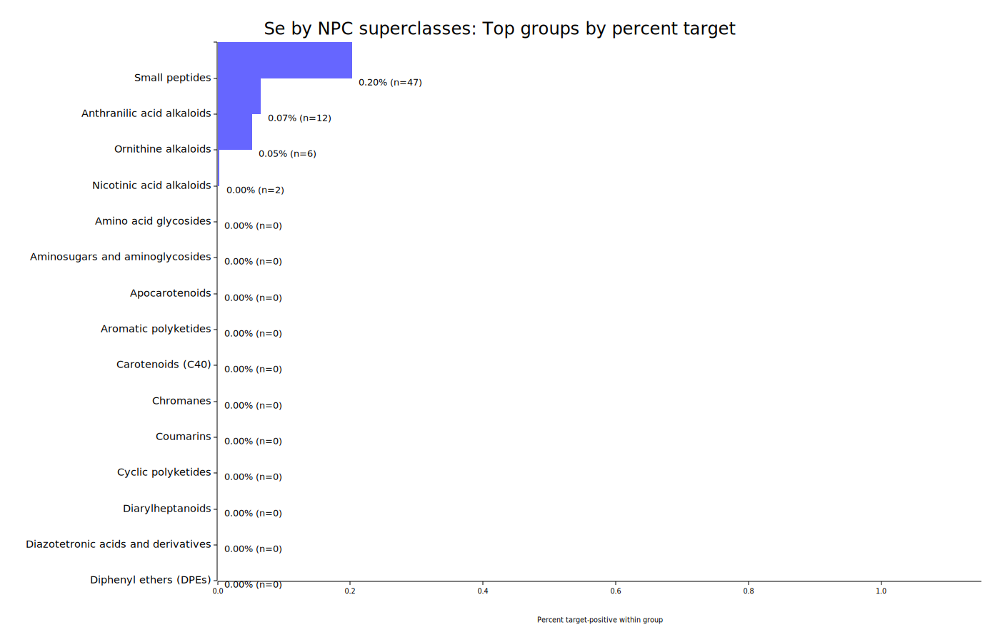</td>
</tr>
</table>

## NPC classes

Natural-product class-level distribution for the target element.

[CSV table](tables/contains_by_npc_classes.csv)

<table>
<tr>
<th>Top groups by target count</th>
<th>Top groups by percent target</th>
</tr>
<tr>
<td width="50%"></td>
<td width="50%">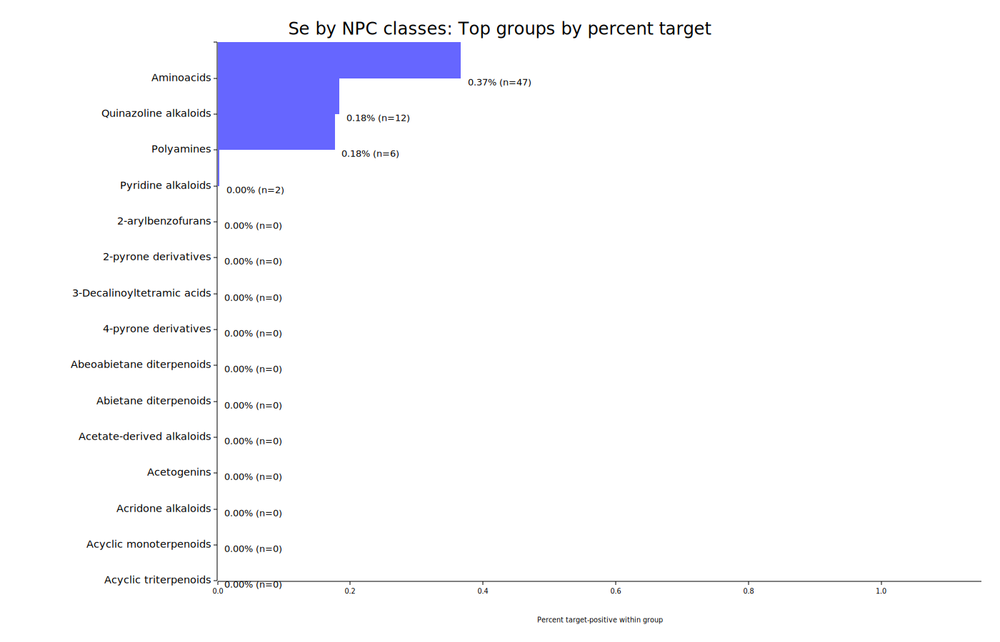</td>
</tr>
</table>

## Source dataset

Distribution by original source dataset.

[CSV table](tables/contains_by_source_dataset.csv)

<table>
<tr>
<th>Top groups by target count</th>
<th>Top groups by percent target</th>
</tr>
<tr>
<td width="50%">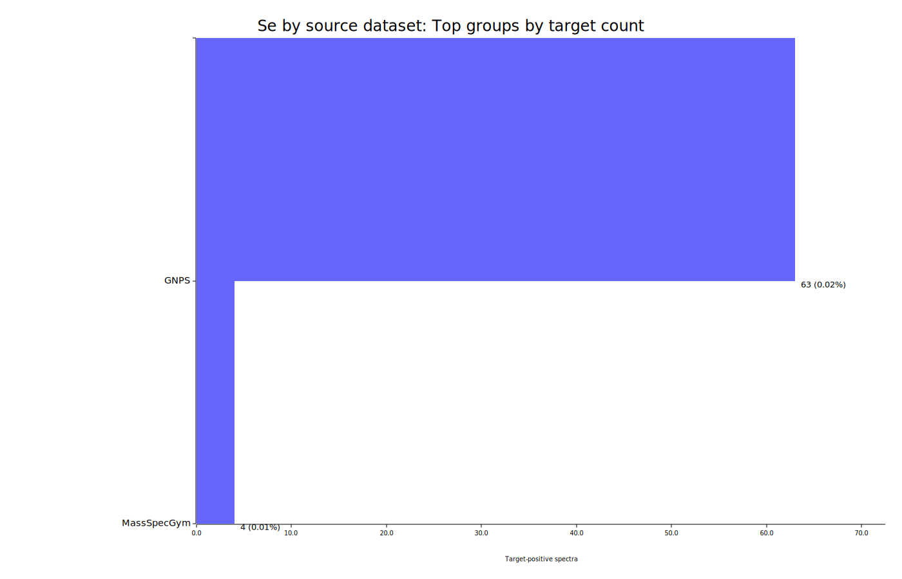</td>
<td width="50%">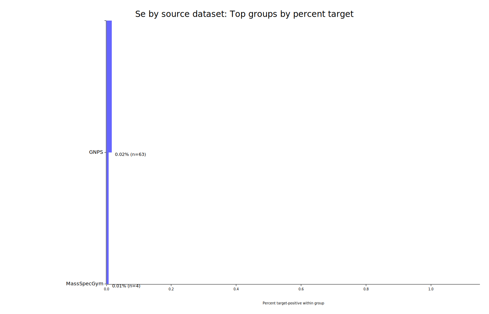</td>
</tr>
</table>

## Organism

Distribution by organism/source organism metadata.

[CSV table](tables/contains_by_organism.csv)

<table>
<tr>
<th>Top groups by target count</th>
<th>Top groups by percent target</th>
</tr>
<tr>
<td width="50%">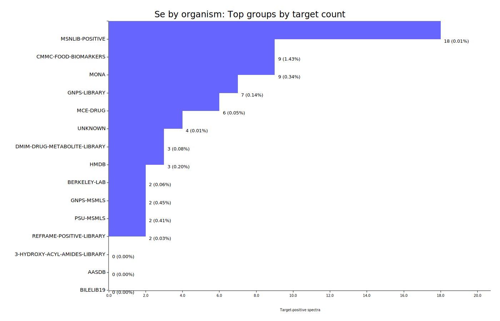</td>
<td width="50%">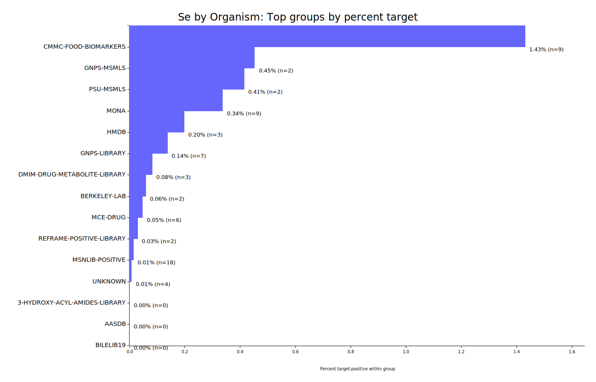</td>
</tr>
</table>

## Ion mode

Distribution by recorded ion mode.

[CSV table](tables/contains_by_ion_mode.csv)

<table>
<tr>
<th>Top groups by target count</th>
<th>Top groups by percent target</th>
</tr>
<tr>
<td width="50%">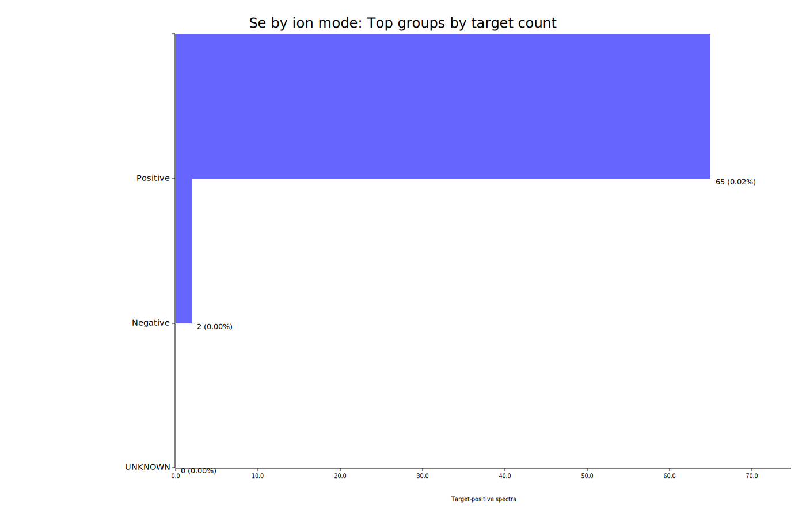</td>
<td width="50%">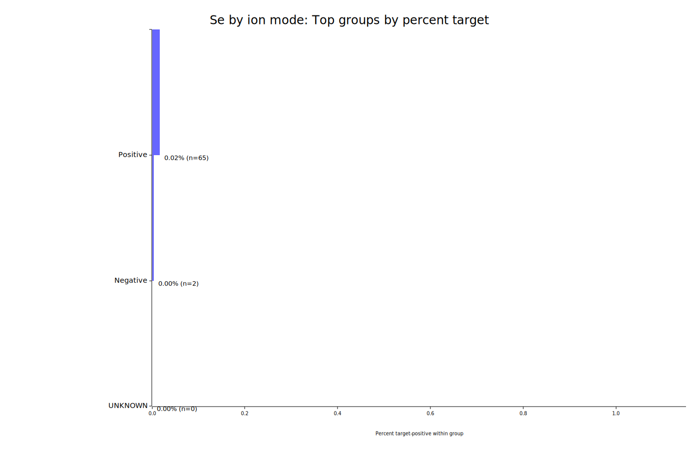</td>
</tr>
</table>

## Source instrument

Distribution by recorded source instrument.

[CSV table](tables/contains_by_source_instrument.csv)

<table>
<tr>
<th>Top groups by target count</th>
<th>Top groups by percent target</th>
</tr>
<tr>
<td width="50%">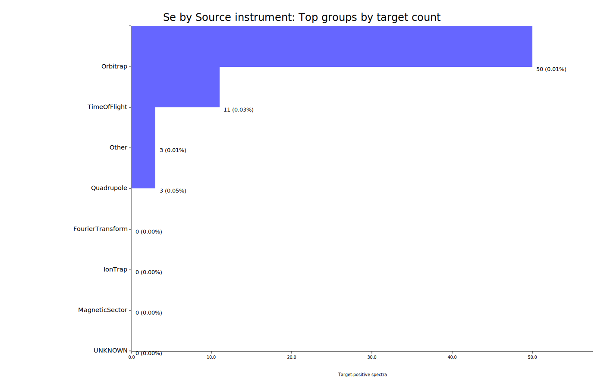</td>
<td width="50%">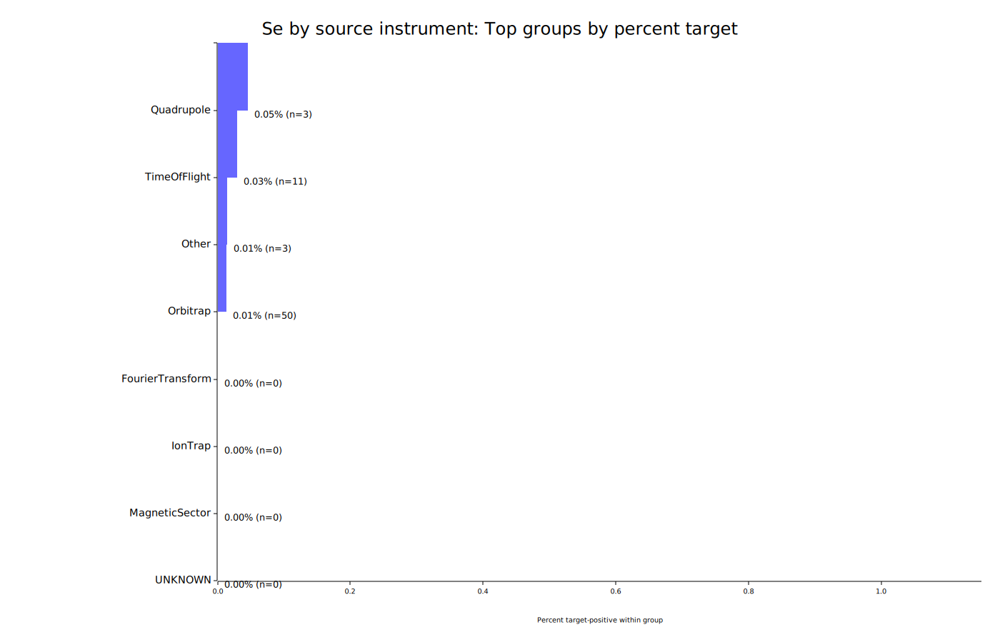</td>
</tr>
</table>

## Library quality

Distribution by library quality metadata.

[CSV table](tables/contains_by_library_quality.csv)

<table>
<tr>
<th>Top groups by target count</th>
<th>Top groups by percent target</th>
</tr>
<tr>
<td width="50%">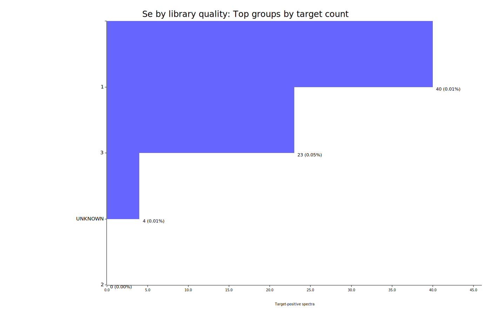</td>
<td width="50%">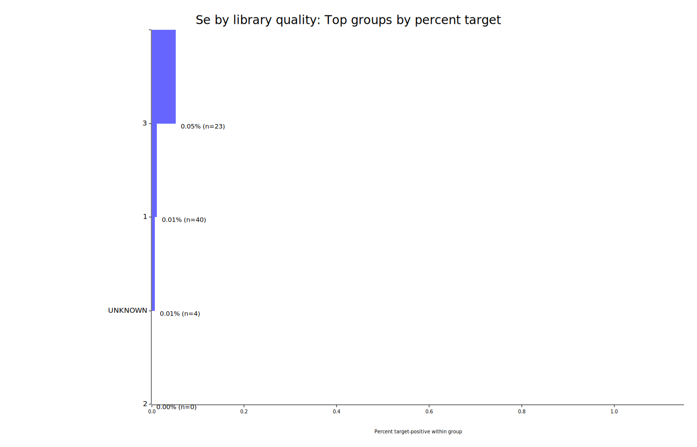</td>
</tr>
</table>
